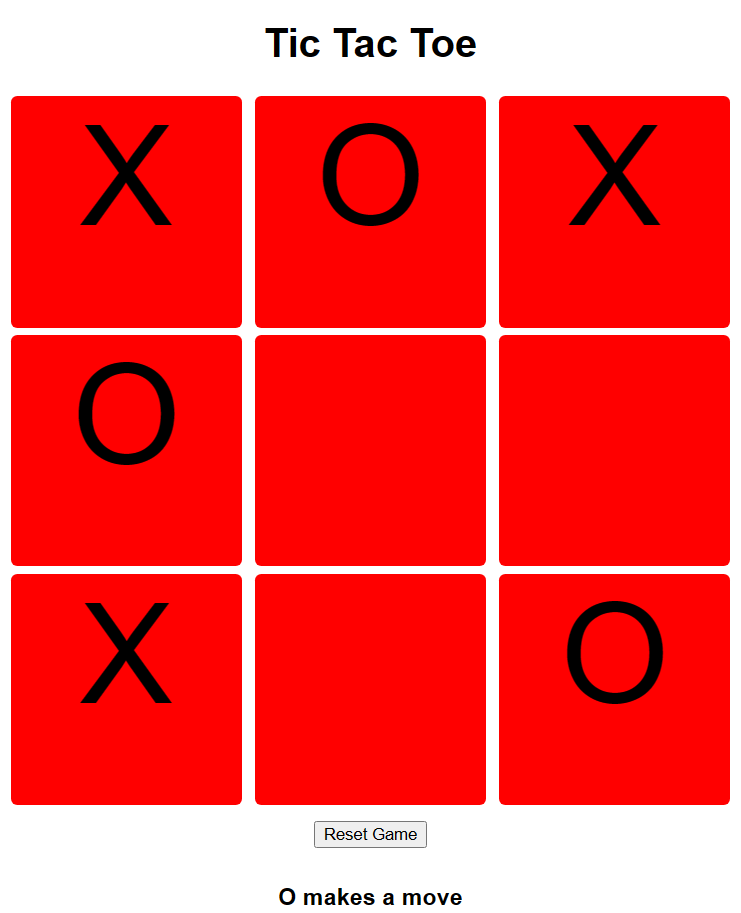

# Tic Tac Toe
Tic Tac Toe is a simple web-based game that allows two players to take turns and compete in the classic Tic Tac Toe game.


## Table of Contents
- [Tic Tac Toe](#tic-tac-toe)
  - [Table of Contents](#table-of-contents)
  - [About](#about)
  - [Usage](#usage)
  - [How To Play](#how-to-play)
  - [License](#license)

## About
Tic Tac Toe is a well-known game where two players take turns marking spaces on a 3x3 grid. The first player to align three of their marks (either "X" or "O") horizontally, vertically, or diagonally wins the game.

This web-based version of Tic Tac Toe allows you to play the game right in your web browser.



## Usage
This section explains how to run the game on your local machine or host it on your own server.
Clone this repository to your local machine:
```bash
git clone https://github.com/RyzhasMomentas/WEB2_TicTacToe.git
```
Open the index.html file in your web browser.
Start playing Tic Tac Toe!

If you want to host this game on your own server or GitHub Pages, you can fork this repository and make modifications as needed.

## How to Play
Open the Tic Tac Toe game in your web browser.
Players take turns by clicking on an empty square on the game board.
The first player starts as "X," and the second player is "O."
The game keeps track of the current player's turn.
The game ends when one player aligns three of their marks horizontally, vertically, or diagonally.
Click the "Reset Game" button to start a new game at any time.

## License
This project is licensed under the MIT License. You are free to use and modify this code for your purposes. If you make improvements or additions, consider contributing back to the original project.


